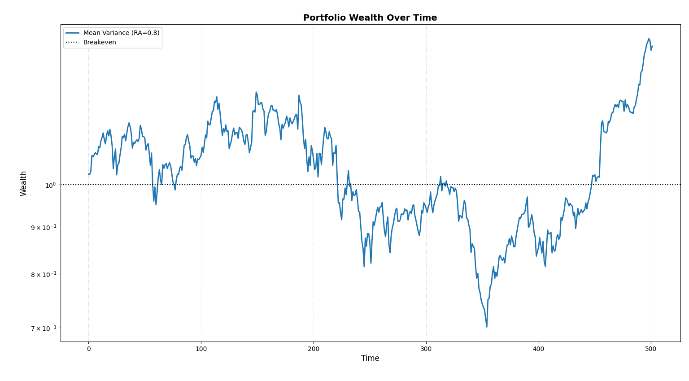

---

What makes a good strategy? Here we will be testing the famous markowitz mean variance portfolio and see how it performs in an out-of-sample, *sort-of* realistic market scenario under stochastic slippage. We will utilize OPES' set of tools to backtest and plot the wealth process.

---

## Import Necessary Modules

```python
# External Modules
import time
import yfinance as yf

# OPES modules
from opes.objectives.markowitz import MeanVariance
from opes.backtester import Backtester
```

We require these python modules for our example. While `time` is built-in, `yfinance` may require a quick `pip install`. From `opes` we import the famous `MeanVariance` optimizer and the `Backtester` class.

---

## Design our Portfolio

I wanted to choose a diverse set of assets while still being risky. Here's what I went with:

```python
# Designing our portfolio
TICKERS = [
            "AAPL", # A smooth stock
            "NVDA", # A volatile stock
            "PFE", # A low beta stock
            "TSLA", # A crazy Stock
            "GME", # An even Crazier Stock
            "TLT", # An ETF
            "SHV" # Cash Proxy
        ]
```

Probably not the best set, but interesting choices for testing.

---

## Fetch Data

Since we have `yfinance`, we will utilize it to obtain our train and test data.

```python
# Obtaining training and test data
# Train-test ratio = 80:20, classic split

# Train Data
train = yf.download(tickers=TICKERS, start="2010-01-01", end="2018-01-01", group_by="ticker", auto_adjust=True)

# De-throttling in case yfinance starts crying
time.sleep(2)

# Test Data
test = yf.download(tickers=TICKERS, start="2018-01-01", end="2020-01-01", group_by="ticker", auto_adjust=True)
```

!!! note "Note:"
	You may have noticed that `train` ends at `2018-01-01`, which happens to be the starting date of `test`. This is intentional, as the `pct_change()` method used within `opes` drops the first element of the dataset since it is used for finding the return change for the next timestep. Since the backtesting engine drops duplicate indices, the rolling backtest data is not contaminated.

Some stocks like `TSLA` doesn't exist at `2010-01-01` but it's not a big deal since OPES handles missing data. `group_by="ticker"` gives us the nice OHLCV format and `auto_adjust=True` is probably for the best.

`yfinance` isn't always so disciplined. Sometimes the ticker orders can differ. This can mess with our backtester and give us wrong results. We can fix it quickly using:

```python
# Ensuring tickers are in same order, yfinance sneaks different orders sometimes
# This is necessary for proper backtesting
train_tickers = train.columns.get_level_values(0).unique()
test  = test.loc[:, train_tickers]
```

Now we have our train and test data.

---

## Backtesting

To backtest, we must require to initialize the portfolio object. We choose a moderately high `risk_aversion=0.8` to penalize variance aggressively given the volatile equity mix.

```python
# Initialize the optimizer with our risk aversion
mvo_ra08 = MeanVariance(risk_aversion=0.8)
```

We can feed `mvo_ra08` into the backtesting engine, along with our training and testing data, with custom costs to obtain the return scenario

```python
# Stochastic backtest with gamma distribution based slippage costs
tester = Backtester(train_data=train, test_data=test, cost={'gamma' : (5, 1)})

# Obtaining returns
# For now, weights and costs dont matter, so we discard them
return_scenario = tester.backtest(
    optimizer=mvo_ra08, 
    rebalance_freq=1, 
    reopt_freq=1,
    clean_weights=True, 
    seed=100
)['returns']
```

We use `rebalance_freq=1` and `reopt_freq=1` so we can see how the portfolio adapts to changes quickly. `seed=100` gaurantees reproducibility and Gamma slippage captures asymmetric execution costs where extreme liquidity events are rare but painful. After obtaining `return_scenario` we can get the metrics and plot wealth.

---

## Performance Metrics

We use the `get_metrics` method from the `Backtester` class to obtain a plethora of metrics.

```python
# Obtain backtest performance metrics
print("MEAN VARIANCE PERFORMANCE")
print("-"*30)
metrics = tester.get_metrics(return_scenario)
for key in metrics:
    print(f"{key}: {metrics[key]}")
```

Since `metrics` is a `dict`, we iterate over the keys to display each element.

---

## Equity Curve

This one's easy, just

```python
# Plotting wealth
tester.plot_wealth(
    {
        "Mean Variance (RA=0.8)": return_scenario,
    }
)
```

yep. That's it.

---

## Outputs

For the metrics, we obtain this set of outputs.

```
MEAN VARIANCE PERFORMANCE
------------------------------
sharpe: 0.04108
sortino: 0.06055
volatility: 2.34389
mean_return: 0.09628
total_return: 41.2199
max_drawdown: 44.3409
var_95: 3.85773
cvar_95: 5.31199
skew: -0.06602
kurtosis: 1.32454
omega_0: 1.1154
```

!!! note "Note:"
	Sharpe, Sortino and Volatility are not annualized. Annualized sharpe is not `0.041`, its `0.041 * sqrt(252) = 0.65`. Similiarly, volatility is `37.20%`.

The result seems *not-so-good*, let's see what happened here by looking at the wealth process.



Ah, now it makes sense. For nearly half of the training period, the portfolio was below breakeven. However, it did reward us with a total return of 41% over a span of two years. That is 18.7% CAGR!

---

So, was Mean-Variance a good strategy? I'll leave it to the reader to guess. But this is a very basic example on how to use OPES. Want to know how to compare strategy's out-of-sample performances? Head on over to [If You Knew the Future](./if_you_knew_the_future.md).