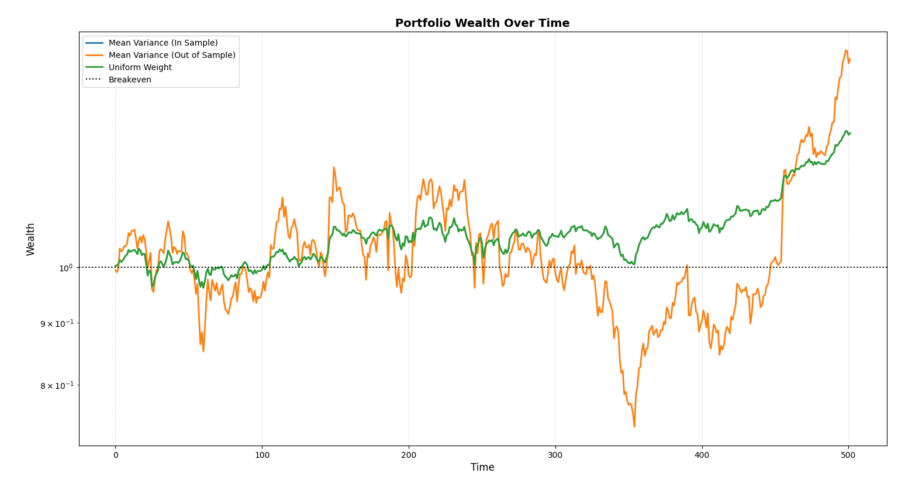

---

In 2009, DeMiguel et. al. conducted a study which compared the out-of-sample performance of various statistical portfolios against the 1/N uniform weight. The famous result was that 1/N often outperformed mean-variance portfolios in out of sample. In this example, we mimic the experiment by conducting a static weight in-sample and out-of-sample comparison between two exact same strategies (mean-variance with common `risk_aversion`) against the uniform equal weight portfolio to test whether *knowing the future* actually provides an edge or if it’s merely an illusion.

---

## Import Necessary Modules

For this example, we require `time`, `yfinance` and `opes`.

```python
import time
import yfinance as yf

from opes.objectives.markowitz import MeanVariance
from opes.objectives.heuristics import Uniform
from opes.backtester import Backtester
```

`yfinance` is not a built-in module, so you might require to run a quick `pip install`.

---

## Design the Portfolio

```python
TICKERS = [
            "AAPL",
            "SHV",
            "PFE",
            "BRK-B",
            "TSLA",
            "TLT",
            "GLD"
        ]
```

The `TSLA` within our portfolio is the core of our analysis. High volatility assets are notoriously hard to estimate.

---

## Fetching Data

```python
# Obtaining training and test data

# Training data
train = yf.download(tickers=TICKERS, start="2010-01-01", end="2018-01-01", group_by="ticker", auto_adjust=True)

# De-throttling for safety
time.sleep(2)

# Testing data
test = yf.download(tickers=TICKERS, start="2018-01-01", end="2020-01-01", group_by="ticker", auto_adjust=True)
```

We will be conducting our test from 2010 to 2020 with the train-test ratio as $80:20$.

Sometimes `yfinance` refuses to be consistent and may give us different ticker orders for each call. We can correct the structure by using the following snippet

```python
# Ensuring tickers are in same order, yfinance sneaks different orders sometimes
# This is necessary for proper backtesting
train_tickers = train.columns.get_level_values(0).unique()
test  = test.loc[:, train_tickers]
```

Now, `train` and `test` are ordered similarly, ensuring proper backtest.

## Backtesting

To begin the backtest, we first initialize our mean-variance optimizer and uniform portfolio.

```python
# Initialize the optimizer with our risk aversion
mean_variance = MeanVariance(risk_aversion=1.0)

# Initialize uniform equal weight
uniform_port = Uniform()
```

We use a high `risk_averion=1.0`. This enables us to differentiate the results very clearly. Using `mean_variance`, we can construct the in-sample and out-of-sample backtesters.

### In-Sample Backtester

The in-sample backtester can be constructed by enforcing `train_data=test` as well as `test_data=test`.

```python
# In-sample backtester
# zero-cost backtesting
tester_in_sample = Backtester(train_data=test, test_data=test, cost={'const' : 0})
in_sample_results = tester_in_sample.backtest(optimizer=mean_variance, clean_weights=True)

# Obtaining weights and returns from the backtest
in_weights = in_sample_results["weights"][0]
return_scenario_in = in_sample_results["returns"]
```

The `rebalance_freq` parameter is defaulted to `None`, imposing a static weight backtest.

### Out-of-Sample Backtester

The out-of-sample backtester is normally written by feeding training and testing datasets to their respective arguments.

```python
# Out-of-sample backtester
# Zero-cost backtesting
tester_out_of_sample = Backtester(train_data=train, test_data=test, cost={'const' : 0})
out_of_sample_results = tester_out_of_sample.backtest(optimizer=mean_variance, clean_weights=True)

# Obtaining weights and returns from the backtest
out_weights = out_of_sample_results["weights"][0]
return_scenario_out = out_of_sample_results["returns"]
```

This is also a static weight backtest.

### Uniform Portfolio Backtester

Since uniform equal weight has constant weights, regardless of test and train data, we can use any backtester to obtain returns. Here we use `tester_in_sample`.

```python
uniform_results = tester_in_sample.backtest(optimizer=uniform_port)
uniform_weights = uniform_results["weights"][0]
uniform_scenario = uniform_results["returns"]
```

---

## Performance Metrics

We can view the tickers, weights and performance metrics of both the tests by creating a custom snippet which displays the ticker array and the weights before iterating over the `metrics` dictionary.

```python
# Obtain in-sample backtest performance metrics
print("\nIN-SAMPLE PERFORMANCE")
print("-"*30)

# Displaying tickers and weights first
print(f"Tickers: {mean_variance.tickers}")
print(f"Weights: {[float(round(x, 2)) for x in in_weights]}")

# Performance metrics
metrics = tester_in_sample.get_metrics(return_scenario_in)
for key in metrics:
    print(f"{key}: {metrics[key]}")

# -----------------------------------------------

# Obtain out-of-sample backtest performance metrics
print("\nOUT-OF-SAMPLE PERFORMANCE")
print("-"*30)

# Displaying tickers and weights first
print(f"Tickers: {mean_variance.tickers}")
print(f"Weights: {[float(round(x, 2)) for x in out_weights]}")

# Performance metrics
metrics = tester_in_sample.get_metrics(return_scenario_out)
for key in metrics:
    print(f"{key}: {metrics[key]}")

# -----------------------------------------------

# Uniform weight performance metrics
print("\nUNIFORM WEIGHT PERFORMANCE")
print("-"*30)

# Displaying tickers and weights first
print(f"Tickers: {uniform_port.tickers}")
print(f"Weights: {[float(round(x, 2)) for x in in_weights]}")

# Performance metrics
metrics = tester_in_sample.get_metrics(uniform_scenario)
for key in metrics:
    print(f"{key}: {metrics[key]}")
```

This gives us insight into the test's findings.

---

## Equity Curves

For plotting the equity curves of both tests, we can use the `plot_wealth` method of any tester we initialized earlier. We use `tester_in_sample`.

```python
# Plotting wealth
tester_in_sample.plot_wealth(
    {
        "Mean Variance (In Sample)": return_scenario_in,
        "Mean Variance (Out of Sample)": return_scenario_out,
        "Uniform Weight": uniform_scenario,
    }
)
```

---

## Outputs

We can find the stark difference between the metrics generated by the three portfolios immediately.

```
IN-SAMPLE PERFORMANCE
------------------------------
Tickers: ['SHV', 'GLD', 'TSLA', 'BRK-B', 'TLT', 'PFE', 'AAPL']
Weights: [0.14, 0.14, 0.14, 0.14, 0.14, 0.14, 0.14]
sharpe: 0.07047
sortino: 0.10124
volatility: 0.75664
mean_return: 0.05332
total_return: 28.81695
max_drawdown: 8.61603
var_95: 1.22202
cvar_95: 1.6736
skew: -0.01171
kurtosis: 2.13713
omega_0: 1.21212

OUT-OF-SAMPLE PERFORMANCE
------------------------------
Tickers: ['SHV', 'GLD', 'TSLA', 'BRK-B', 'TLT', 'PFE', 'AAPL']
Weights: [0.0, 0.0, 0.65, 0.0, 0.0, 0.1, 0.25]
sharpe: 0.04452
sortino: 0.06642
volatility: 2.41369
mean_return: 0.10746
total_return: 48.27358
max_drawdown: 38.80204
var_95: 3.59031
cvar_95: 5.30705
skew: 0.39797
kurtosis: 3.6958
omega_0: 1.13461

UNIFORM WEIGHT PERFORMANCE
------------------------------
Tickers: ['SHV', 'GLD', 'TSLA', 'BRK-B', 'TLT', 'PFE', 'AAPL']
Weights: [0.14, 0.14, 0.14, 0.14, 0.14, 0.14, 0.14]
sharpe: 0.07047
sortino: 0.10124
volatility: 0.75664
mean_return: 0.05332
total_return: 28.81695
max_drawdown: 8.61603
var_95: 1.22202
cvar_95: 1.6736
skew: -0.01171
kurtosis: 2.13713
omega_0: 1.21212
```

Here, hilariously, the in-sample mean-variance portfolio collapsed to the uniform equal weight, despite having perfect knowledge of returns. In other words, the portfolio which ignored information chose the same decision as the one which had perfect information, both of which went on being superior to the estimated, out-of-sample test.

Comparing the metrics between out-of-sample and uniform weight gives us even more insight into statistical estimation.

| Metric        | Mean-Variance | Uniform Weight |
|---------------|---------------|---------|
| Sharpe Ratio  |     0.70      |  **1.11**   |
| Volatility    |     38.25     |  **12.01**  |
| Mean Return   |     **0.10%**     |  0.05%  |
| Total Return  |     **48.27%**    |  28.81% |
| Max Drawdown  |     38.8%     |  **8.61%**  |

!!! note "Note:"
	As stated previously, the sharpe ratios and volatilities have been annualized before presenting on the table.

While the out-of-sample mean-variance generated an astonishing 19.46% more returns over a two-year span compared to uniform equal weight (and in-sample mean-variance), the risk the portfolio took was far from sane. Comparing the maximum drawdowns of both out-of-sample mean-variance (38.8%) and the uniform equal weight (8.61%) along with the distinct sharpe ratios are plentiful to convince one that estimation error of mean-variance is not a hoax. If you're not convinced then take a look at the plot:



The uniform equal weight (and the in-sample mean variance) drifted up slowly and consistently, earning it's stable 1.11 sharpe ratio while the out-of-sample portfolio's wealth process cannot be differentiated from a seismograph reading.

---

So, it is conclusive that perfect information helps, but robustness helps more often. Maybe sometimes, ignoring information might be better than estimating it.

Want to skip the theory talk and select a portfolio which you can use today? Head on over to [Which Kelly is Best?](./which_kelly_is_best.md).