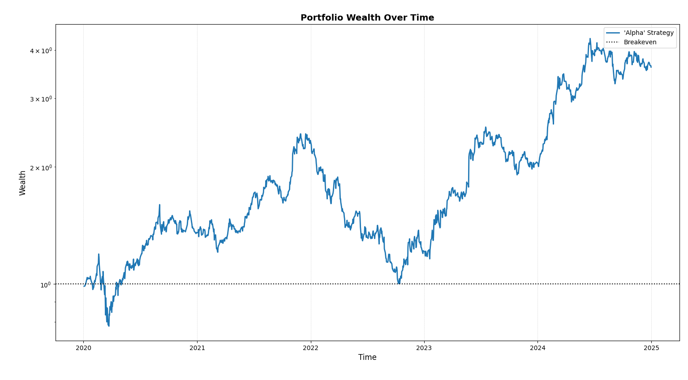

---

Alpha, the golden egg which every quant, finance-bro and quick-buck students chase after. Alpha is extremely difficult to find, with most signals decaying quicker than you can spell *"Stochastic Control Engine"*. 

Suppose you already have an institutional-grade alpha signal, constructed from historical price data. Before you get carried away fantasizing about supercars and skyline penthouses, the first thing you must do is test it.

`opes` provides a framework to do exactly that. In this example, I’ll walk through the process of testing a strategy and analyzing its performance.

---

## Importing Necessary Modules

We will import a few models necessary for this example.

```python
# Built in modules
import time

# External modules, might require a `pip install <module_name>`
import yfinance as yf
import pandas as pd 
import numpy as np

# Our backtester object to test the strategy
from opes.backtester import Backtester
```

Import some additional modules if they are required for your strategy. But for the simple "alpha" strategy we're using here it's not required.

--- 

## Designing Our Portfolio

We will use a simple two stock portfolio for this test.

```python
TICKERS = [
    "NVDA",    # Growth
    "PFE"      # Low Beta
]
```

I always love a good risky-safe combination of assets.

---

## Constructing the Alpha Engine

Welcome to the playground. Here we construct the alpha strategy. Your alpha engine must have an `optimize` method which must output weights for the timestep given the necessary parameters. Which means, you can write any code within the object, just that it should return weights when `optimize()` method is called.

Your alpha strategy can include an OPES objective with `custom_cov` or `custom_mean`.

```python
class SuperDuperAlphaEngine:
    
    def __init__(...):
        # ---- Initialization stuff ----
        self.ledoitwolf = LedoitWolf() # After importing from sklearn
        self.weights = None
        self.optimizer = MinVariance() # After importing from opes

    def _optimize(
        self, 
        data,  # Mutli-index or Single-index data
        weight_bounds=(0,1),  # Weight bounds for optimization
        w=None,  # Weights for warm start
        **kwargs # Very good safety net just in case
    ):
        # Returns array
        return_array = self._get_me_my_damn_data(data)
        
        # Custom covariance estimation (sklearn syntax)
        my_cov = self.ledoitwolf.fit(return_array).covariance_

        # Optimizing with warm weights if provided
        if w is not None:
            self.weights = self.optimizer.optimize(
                data, 
                weight_bounds=weight_bounds, 
                w=w, 
                custom_cov=my_cov
            )
        else:
            self.weights = self.optimizer.optimize(
                data, 
                weight_bounds=weight_bounds, 
                custom_cov=my_cov
            )

        # Returning self.weights [IMPORTANT]
        return self.weights
```

Or it can be a custom written strategy, like softmax-momentum.

```python
class SuperDuperAlphaEngine:
    def __init__(...):
        # ---- Initialization stuff ----
        self.weights = None
    
    # optimize spits weight for softmax-momentum strategy
    def optimize(self, data, **kwargs):
        
        # Lookback window and exponential tilt
        lookback = 20
        scale = 10

        # Handle MultiIndex columns (stock, field)
        if isinstance(data.columns, pd.MultiIndex):
            stocks = data.columns.get_level_values(0).unique()
            close1 = data[(stocks[0], 'Close')].values
            close2 = data[(stocks[1], 'Close')].values
        else:
            close_cols = [col for col in data.columns if 'close' in col.lower()]
            close1 = data[close_cols[0]].values
            close2 = data[close_cols[1]].values

        n = len(close1)

        # A fallback is always nice
        if n <= lookback:
            self.weights = np.array([0.5, 0.5])
            return self.weights

        # Comparing each asset with its past to compute returns over lookback window
        ret1 = (close1[-1] - close1[-1 - lookback]) / close1[-1 - lookback]
        ret2 = (close2[-1] - close2[-1 - lookback]) / close2[-1 - lookback]

        # Converting to a numpy array for F A S T vectorization
        momentum = np.array([ret1, ret2])

        # Exponential tilting with scaling
        exp_momentum = np.exp(scale * momentum)

        # Normalizing... Reminds me of `ExponentialGradient`
        self.weights = exp_momentum / exp_momentum.sum()

        # Returning weights
        return self.weights
```

Or it can even be a wallet-nuke.

```python
class SuperDuperAlphaEngine:
    def __init__(...):
        # ---- Initialization stuff ----
        self.weights = None
    
    # Random allocation
    def optimize(self, data, **kwargs):
        weights = np.random.rand(2) 
        self.weights = weights / weights.sum()
        return self.weights
```

I will be using the second one, softmax-momentum, for our example. 

---

## Fetching Data

We can fetch data using the `yfinance` library

```python
# Train dataset
train = yf.download(tickers=TICKERS, start="2010-01-01", end="2020-01-01", group_by="ticker", auto_adjust=True)

# De-throttling yfinance
time.sleep(2)

# Test dataset
test = yf.download(tickers=TICKERS, start="2020-01-01", end="2025-01-01", group_by="ticker", auto_adjust=True)

# To order tickers properly
train_tickers = train.columns.get_level_values(0).unique()
test  = test.loc[:, train_tickers]
```

---

## Backtesting

With our train and test data up and ready, we can begin the backtest. We backtest this strategy under a *near-catastrophic* 40 bps constant slippage.

```python
# Initialize our engine
alpha_strategy = SuperDuperAlphaEngine()

# Initialize our backtester
tester = Backtester(train_data=train, test_data=test, cost={'const': 40})

# Backtest with `rebalance_freq` and `reopt_freq` set to 1 for daily momentum
alpha_returns = tester.backtest(optimizer=alpha_strategy, rebalance_freq=1, reopt_freq=1)
```

Upon having `alpha_returns` we can use it to plot wealth and get metrics.

```python
# Plotting wealth curve
tester.plot_wealth(
    {
        "'Alpha' Strategy" : alpha_returns["returns"]
    },
    timeline=alpha_returns['timeline'] # As of opes version 0.9.0, timelines are supported to mark the x-axis
)

# Obtaining metrics dictionary and display
print("ALPHA STRATEGY PERFORMANCE")
print("-"*30)
metrics = tester.get_metrics(alpha_returns["returns"]),
for key in metrics:
    print(f"{key}: {metrics[key]}")
```

---

## Results

For our 'alpha' strategy, we obtain the following results.

```
ALPHA STRATEGY PERFORMANCE
------------------------------
sharpe: 0.05425        # 0.861 Annualized
sortino: 0.08487       # 1.347 Annualized
volatility: 2.41957    # 38.40 Annualized
growth_rate: 0.10222
mean_return: 0.13125
total_return: 261.21209
max_drawdown: 58.82267
mean_drawdown: 17.95662
ulcer_index: 0.23845
var_95: 3.48897
cvar_95: 5.03537
skew: 0.58399
kurtosis: 6.10293
omega_0: 1.16452
hit_ratio: 0.50756
```

Not so "alpha" now, is it. `0.861` sharpe is clearly suboptimal for an alpha strategy, paired with an *ok* 1.347 sortino ratio and a *not ok* 38.40% volatility proves my previous point on why alpha is very difficult to find. If using a simple strategy like softmax-momentum generated excess positive returns then the economy would be in shambles.

But it doesn't. That's why such strategies are only supposed to be used for pedagogical purposes... or when the time (regime) is right. In the meantime, we'll look at the plot to understand how our momentum strategy behaved over time.



As we can see, our strategy started off at `wealth=1`, soared up high into the sky like a golden eagle and plummetted like a peregrine falcon back to breakeven nearing 2023. Aside from the bird references, we can visually notice the huge `58.82%` maximum drawdown experienced, confirming the usual behaviour of momentum strategies. Now, even though the total return an agent would have obtained on this strategy is a whopping `261.21%` over a span of 5 years, which is nothing short of impressive, the soul crushing events which happened during the timeline is what makes this strategy unusable practically.

---

To conclude, I believe I have successfully demonstrated how you can test a strategy using `opes`'s built in backtesting engine... and failed to find alpha. However, my failure doesn't restrict the reader to finding something genuinely extra-ordinary. If you believe you have identified a non-trivial signal backtest using `opes`, use `cost={'jump':(...)}` if you must and evaluate how your approach fares once exposed to real-world constraints. Most ideas will fail this process and they should. 

Still, markets have not exhausted human ingenuity. With enough rigor, skepticism and patience, it is not impossible that something exceptional remains undiscovered. And who knows, if you do manage to find it, you might just end up being the next Jim Simons.