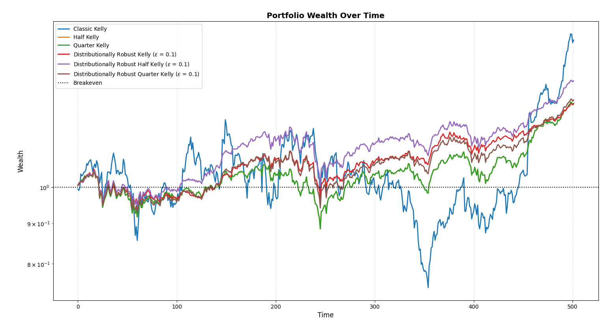

---

The Kelly Criterion, proposed by John Larry Kelly Jr., is the mathematically optimal decision which a rational agent is to make under a specific probability distribution of outcomes and their payoffs. Even though classical Kelly remains my favorite strategy, it is widely understood as unstable as it relies on exactly precise estimates of the return distribution for it to work. In other words, Kelly requires the true return distribution to make the mathematically optimal decision, and even small errors leads to extremely unstable allocations.

There are numerous variants of the Kelly Criterion introduced to combat this fragile dependency, such as fractional Kelly, popularized by Ed Thorpe, and distributionally robust Kelly models. In this example, we compare several of the most well-known Kelly variants under identical out-of-sample conditions, evaluating their realized performance and wealth dynamics using `opes`.

!!! warning "Warning:"
    This example may be computationally heavy because of multiple optimization models running with a low `reopt_freq=5`. If you prefer better performance, increase `reopt_freq` to monthly (`21`) or any value much greater than `5`.

---

## Importing Necessary Modules

We import a few modules which are necessary for this example.

```python
# External Modules
import time
import yfinance as yf
from  tabulate import tabulate # Optional, for nice display

# OPES modules
from opes.objectives.utility_theory import Kelly
from opes.objectives.distributionally_robust import KLRobustKelly
from opes.backtester import Backtester
```

`time` is built-in. `yfinance` and `tabulate` are not. Use `pip install <module_name>` to install them both if required.

---

## Designing our Portfolio

To push our test to the maximum limits (and to avoid robust optimizers clinging on ETFs and Cash Proxies), we choose a portfolio full of risky assets.

```python
# Designing our portfolio
TICKERS = [
    "AAPL",   # Large-cap tech
    "MSFT",   # Large-cap tech
    "XOM",    # Energy / cyclicals
    "JNJ",    # Defensive healthcare
    "PFE",    # Pharma
    "WMT",    # Consumer staples
    "JPM",    # Financials
    "GE",     # Industrial
    "TSLA",   # High-volatility growth
    "GLD",    # Gold
]
```

`TICKERS` list recommended by GPT. Seems risky enough.

--- 

## Fetching Data

We utilize `yfinance` to obtain our train and test datasets

```python
# Obtaining training and test data
# Train-test ratio = 80:20, classic split
# Train Data
train = yf.download(tickers=TICKERS, start="2010-01-01", end="2018-01-01", group_by="ticker", auto_adjust=True)

# De-throttling in case yfinance starts crying
time.sleep(2)

# Test Data
test = yf.download(tickers=TICKERS, start="2018-01-01", end="2020-01-01", group_by="ticker", auto_adjust=True)
```

In the common case of `yfinance` giving different ticker orders, we can utilize the following snippet to re-order them.

```python
# Ensuring tickers are in same order, yfinance sneaks different orders sometimes
# This is necessary for proper backtesting
train_tickers = train.columns.get_level_values(0).unique()
test  = test.loc[:, train_tickers]
```

---

## Setting Up Ambiguity Radius

For distributionally robust Kelly models, we need to define a radius for the ambiguity set (ball). Since an arbitrary radius value may annoy certain individuals, I will enforce a common heuristic.

$$
\epsilon \sim \mathcal{O}\left(\frac{1}{\sqrt{n}}\right)
$$

with $n$ being the sample size, which we take as the total `train` + `test` length (we also subtract 1 because `pct_change()` drops the first value).

```python
# An ambiguity set radius heuristic
# radius = 1/sqrt(number of samples)
KLradius = len(test) + len(train) - 1
KLradius = 1 / (KLradius ** 0.5)
```

---

## Initializing Optimizers

We begin initializing our Kelly variants using models from `opes`.

```python
# Initialize the optimizer with our risk aversion
classic_kelly = Kelly(fraction=1) # My favorite
half_kelly = Kelly(fraction=0.5)
quarter_kelly = Kelly(fraction=0.25)
kldr_kelly = KLRobustKelly(radius=KLradius, fraction=1)
kldr_halfkelly = KLRobustKelly(radius=KLradius, fraction=0.5)
kldr_quarterkelly = KLRobustKelly(radius=KLradius, fraction=0.25)
```

for distributionally robust variants, we utilize `KLradius` for the ambiguity radius.

---

## Backtesting

Using the `Backtester` class from `opes`, we backtest these strategies under a constant, but high, cost of 20 bps and `reopt_freq=5` (weekly). `rebalance_freq` is defaulted to `1`. Oh, and we clean weights too.

```python
# A constant slippage backtest
tester = Backtester(train_data=train, test_data=test, cost={'const' : 20})

# Obtaining returns
# For now, weights and costs dont matter, so we discard them
ck_scenario = tester.backtest(optimizer=classic_kelly, reopt_freq=5, clean_weights=True)['returns']
hk_scenario = tester.backtest(optimizer=half_kelly, reopt_freq=5, clean_weights=True)['returns']
qk_scenario = tester.backtest(optimizer=quarter_kelly, reopt_freq=5, clean_weights=True)['returns']
kldrk_scenario = tester.backtest(optimizer=kldr_kelly, reopt_freq=5, clean_weights=True)['returns']
kldrhk_scenario = tester.backtest(optimizer=kldr_halfkelly, reopt_freq=5, clean_weights=True)['returns']
kldrqk_scenario = tester.backtest(optimizer=kldr_quarterkelly, reopt_freq=5, clean_weights=True)['returns']
```

---

## Custom Metrics Viewer

This part is optional, but I added it anyways since it displays data nicely, crucial for me for making this little book. We utilize `tabulate` to generate markdown tables whilst also annualizing and rounding data.

### Construct the Metrics List

It's just a list of metrics dictionaries for every strategy

```python
# Metrics List
metrics_array = [
    tester.get_metrics(ck_scenario),
    tester.get_metrics(hk_scenario),
    tester.get_metrics(qk_scenario),
    tester.get_metrics(kldrk_scenario),
    tester.get_metrics(kldrhk_scenario),
    tester.get_metrics(kldrqk_scenario)
]
```

### Annualize Values and Round Them

Since `sharpe`, `sortino` etc are usually interpreted annually, we annualize so its... interpretable.

```python
# Annualize certain values while also rounding them
for i in metrics_array:
    for j in i:
        if j in ['sharpe', 'sortino', 'volatility']:
            i[j] = i[j] * (252 ** 0.5)
        i[j] = round(i[j], 2)
```

Pretty simple. Just iterate and modify.

### Constructing Headers

```python
# Hardcoding headers
headers = [
    "Metric",
    "Classic Kelly",
    "Half-Kelly",
    "Quarter-Kelly",
    "KL Robust Kelly",
    "KL Robust Half-Kelly",
    "KL Robust Quarter-Kelly"
]
```

Values are hardcoded. Fine for now, don't do this if your code is walking into production.

### Convert Metrics Format and Display

Since `tabulate` uses a row-vise format, it's a little tricky to align the data correctly. But we can make it work by converting the performance metrics into a list and appending each value to the list containing the corresponding metric.

```python
# Converting metrics into tabulate format and displaying in 'github' format
metrics = list(metrics_array[0].keys())
data = []
for m in metrics:
    row = [m]
    for strat_metrics in metrics_array:
        row.append(strat_metrics[m])
    data.append(row)
print(tabulate(data, headers=headers, tablefmt="github"))
```

We display (print) using `tablefmt="github"`. You can try other styles too.

---

## Equity Curves

I don't have to say anything here, right?

```python
# Plotting wealth
tester.plot_wealth(
    {
        "Classic Kelly": ck_scenario,
        "Half Kelly": hk_scenario,
        "Quarter Kelly": qk_scenario,
        r"Distributionally Robust Kelly ($\varepsilon$ = 0.1)": kldrk_scenario,
        r"Distributionally Robust Half Kelly ($\varepsilon$ = 0.1)": kldrhk_scenario,
        r"Distributionally Robust Quarter Kelly ($\varepsilon$ = 0.1)": kldrqk_scenario,
    }
)
```

---

## Outputs

Thanks to `tabulate`, our data is displayed elegantly. We get the comprehensive metrics for each strategy.

| Metric       |   Classic Kelly |   Half-Kelly |   Quarter-Kelly |   KL Robust Kelly |   KL Robust Half-Kelly |   KL Robust Quarter-Kelly |
|--------------|-----------------|--------------|-----------------|-------------------|------------------------|---------------------------|
| sharpe       |            0.74 |         0.87 |            0.87 |              1.06 |                   **1.11** |                      0.95 |
| sortino      |            1.11 |         1.16 |            1.16 |              1.32 |                   **1.41** |                      1.21 |
| volatility   |           39.38 |        15.29 |           15.29 |             **12.19** |                  14.9  |                     14.46 |
| mean_return  |            **0.12** |         0.05 |            0.05 |              0.05 |                   0.07 |                      0.05 |
| total_return |           **53.28** |        27.5  |           27.5  |             27.31 |                  36.15 |                     28.77 |
| max_drawdown |           38.59 |        17.01 |           17.01 |             **12.48** |                  15.69 |                     15.23 |
| var_95       |            3.7  |         1.72 |            1.72 |              **1.35** |                   1.62 |                      1.51 |
| cvar_95      |            5.46 |         2.37 |            2.37 |              **1.93** |                   2.38 |                      2.31 |
| skew         |            **0.41** |        -0.26 |           -0.26 |             -0.6  |                  -0.37 |                     -0.37 |
| kurtosis     |            3.78 |         **2.93** |            **2.93** |              3.7  |                   3.69 |                      3.63 |
| omega_0      |            1.14 |         1.16 |            1.16 |              1.2  |                   **1.22** |                      1.18 |

We find that the Distributionally Robust Half Kelly variant dominates sharpe, sortino and omega ratios, while classical Kelly if more focused on mean return and total return. This showcases the distinct difference between different variants of Kelly. The classic Kelly Criterion, even though generating a huge sum of 53.25% returns over a two-year span, is susceptible to high drawdowns and volatility, while more robust strategies like DR-Kelly and fractional variants reduce volatility non-linearly while preserving commendable returns. The wealth process completes our analysis as the direct insight into the behaviour of different strategies.



Even though Classic Kelly (blue) generated more returns in total, it is reckless. Very reckless. Other variants help in achieving signficant returns while remaining sane, making it a superior choice for a mortal investor.

---

This example demonstrates the distinct personalities of the Kelly Criterion. Even though, it is theoretically optimal, it requires precise "estimates", which is impossible in the real world. Not using Classic Kelly in practical situations is probably best for all of us.

> "Double your money in 10 years... but lose 50% tomorrow? That's the real deal."

> *—Kelly, probably*